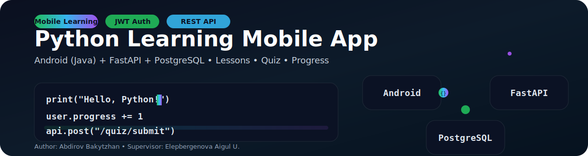
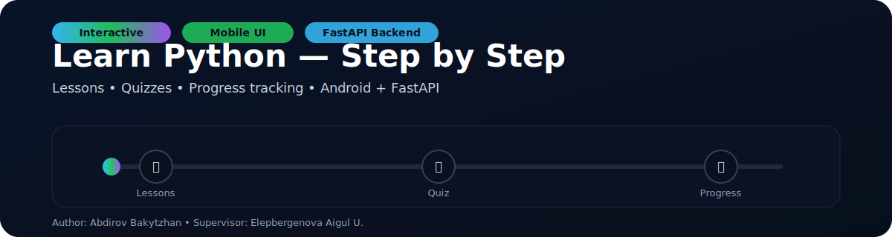
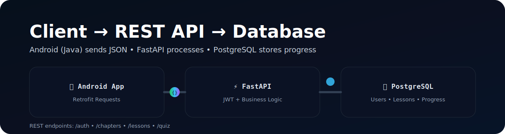

<p align="center">
  
</p>


# 🐍 Python тілін үйренуге арналған мобильді қосымша

**ТҮСІНДІРМЕ ЖАЗБА**

- **Орындаған:** Абдиров Бакытжан  
- **Жоба жетекшісі:** Елепбергенова Айгуль Узбековна  

---

## 📌 Жоба туралы

Бұл жоба Python бағдарламалау тілін үйренуге арналған **мобильді қосымша** болып табылады.  
Қосымша **клиент-сервер архитектурасына** негізделген және қолданушыға сабақтарды оқуға, тест тапсыруға және прогресті бақылауға мүмкіндік береді.

---

## 📑 Мазмұны

1. [Кіріспе](#-кіріспе)  
2. [Техникалық қамтамасыз ету](#-техникалық-қамтамасыз-ету)  
3. [Жүйенің архитектурасы](#-жүйенің-архитектурасы)  
4. [Жобаны жүзеге асыру](#-жобаны-жүзеге-асыру-имплементация)  
5. [Тестілеу және нәтижелер](#-тестілеу-және-нәтижелер)  
6. [Қорытынды](#-қорытынды)  
7. [Қосымшалар](#-қосымшалар)

---
<p align="center">
  
</p>

## 🔰 Кіріспе

### 1.1 Жобаның өзектілігі
Ақпараттық технологиялар дәуірінде бағдарламалау дағдыларының маңызы артып келеді. Python — ең танымал бағдарламалау тілдерінің бірі және ол:
- Жасанды интеллект (AI)
- Машиналық оқыту (ML)
- Деректерді талдау (Data Science)
- Web әзірлеу  
салаларында кеңінен қолданылады.

Қазақ тілді аудитория үшін мобильді форматта интерактивті оқу ресурстары аз болғандықтан, бұл жоба сол олқылықтың орнын толтыруға бағытталған.

### 1.2 Жобаның мақсаты мен міндеттері

**Мақсат:**  
Python тілін үйретуге арналған толыққанды мобильді жүйе құру.

**Міндеттер:**
1. Android платформасында ыңғайлы интерфейс жасау  
2. Python (FastAPI) негізінде қауіпсіз REST API құру  
3. PostgreSQL деректер қорын жобалау  
4. Тіркеу және авторизация жүйесін іске асыру  
5. Сабақтар, тесттер және прогресс логикасын жүзеге асыру  

---

## 🛠 Техникалық қамтамасыз ету

### 2.1 Frontend: Android (Java)
- **Тіл:** Java  
- **IDE:** Android Studio  
- **HTTP сұраныстар:** Retrofit 2  

### 2.2 Backend: Python (FastAPI)
- **Фреймворк:** FastAPI  
- **Ерекшелігі:** Pydantic валидациясы, Swagger/OpenAPI құжаттамасы  
- **API:** REST (JSON)  

### 2.3 Деректер қоры: PostgreSQL
PostgreSQL — ACID стандартын қолдайтын сенімді деректер қоры, жобаны кеңейтуге өте қолайлы.

---

## 🏗 Жүйенің архитектурасы

### 3.1 Клиент-сервер архитектура

```mermaid
graph TD
    A[Android Client (Java)] -->|HTTP/S (JSON)| B(FastAPI Server);
    B -->|SQL| C[PostgreSQL DB];
    A -.->|UI| User;
    B -.->|Business Logic| ServerLogic;
    C -.->|Data Storage| DataStorage;

<p align="center">
  
</p>

3.2 Деректер қоры (ER-диаграмма)
erDiagram
    Users ||--o{ UserProgress : has
    Lessons ||--o{ UserProgress : tracks
    Lessons ||--o{ Quizzes : includes
    
    Users {
        int id PK
        string username
        string hashed_password
    }
    
    Lessons {
        int id PK
        string title
        string content
    }
    
    UserProgress {
        int user_id FK
        int lesson_id FK
        boolean completed
        timestamp completion_date
    }
    
    Quizzes {
        int id PK
        int lesson_id FK
        string question_text
        string correct_answer
    }

3.3 API эндпоинттар
Метод	Маршрут	Сипаттамасы
POST	/api/v1/auth/register	Жаңа пайдаланушыны тіркеу
POST	/api/v1/auth/login	JWT токенін алу
GET	/api/v1/chapters	Барлық тараулар
GET	/api/v1/lessons/{id}	Сабақ мазмұны
POST	/api/v1/quiz/submit	Тест тапсыру
GET	/api/v1/leaderboard	Рейтинг
⚙ Жобаны жүзеге асыру (Имплементация)
4.1 Авторизация және қауіпсіздік

Құпия сөздер Passlib арқылы хэштеледі

Авторизация JWT Token арқылы іске асады

Retrofit AuthInterceptor әр сұранысқа токенді қосады

4.2 Frontend: "Сабақтар" модулі

Retrofit арқылы серверден тараулар/сабақтар тізімі алынады. UI-де RecyclerView арқылы көрсетіледі.

Retrofit интерфейсі (мысал):

public interface ApiService {
    @GET("api/v1/chapters")
    Call<List<ChapterResponse>> getChapters();
}


RecyclerView XML (мысал):

<androidx.recyclerview.widget.RecyclerView
    android:id="@+id/chaptersRecyclerView"
    android:layout_width="match_parent"
    android:layout_height="match_parent"
    app:layoutManager="androidx.recyclerview.widget.LinearLayoutManager"
/>

4.3 Backend: API endpoint мысалы (FastAPI)
@router.get("/", response_model=List[ChapterResponse])
def get_all_chapters(
    db: Session = Depends(get_db),
    current_user: User = Depends(get_current_user)
):
    """
    Барлық тарауларды және олардың ішіндегі сабақтарды қайтарады.
    """
    chapters = db.query(Chapter).options(selectinload(Chapter.lessons)).all()
    return chapters

🧪 Тестілеу және нәтижелер
5.1 API тестілеу

FastAPI Swagger UI (/docs) арқылы эндпоинттар тесттен өтті.

5.2 Мобильді қосымшаны тестілеу

Android Emulator (Pixel 6, API 34) арқылы тексерілді:

Тіркелу / кіру

Сабақ оқу

Тест тапсыру

Прогресс бақылау

5.3 Кездескен қиындықтар

Сервермен байланыс қателері (SocketTimeoutException)

Timestamp форматының парсинг мәселесі (GSON)

UI синхронизациясы (Toolbar + BottomNavigation)
<p align="center">
  
</p>


✅ Қорытынды

Жоба нәтижесінде Python тілін үйренуге арналған клиент-сервер архитектуралы мобильді платформа жасалды.
Бұл қосымша жаңадан бастаушыларға сапалы және қолжетімді білім алуға мүмкіндік береді.

Болашақ жоспарлар:

Онлайн компилятор қосу

AI чат-бот интеграциялау

iOS нұсқасын жасау

📚 Қосымшалар (Пайдаланылған әдебиеттер)

Android Developers Documentation — https://developer.android.com

FastAPI Documentation — https://fastapi.tiangolo.com

Retrofit / Room / Glide ресми құжаттамалары


screenshots/1.png
screenshots/2.png
screenshots/3.png
screenshots/4.png
screenshots/5.png
screenshots/6.png
screenshots/7.png